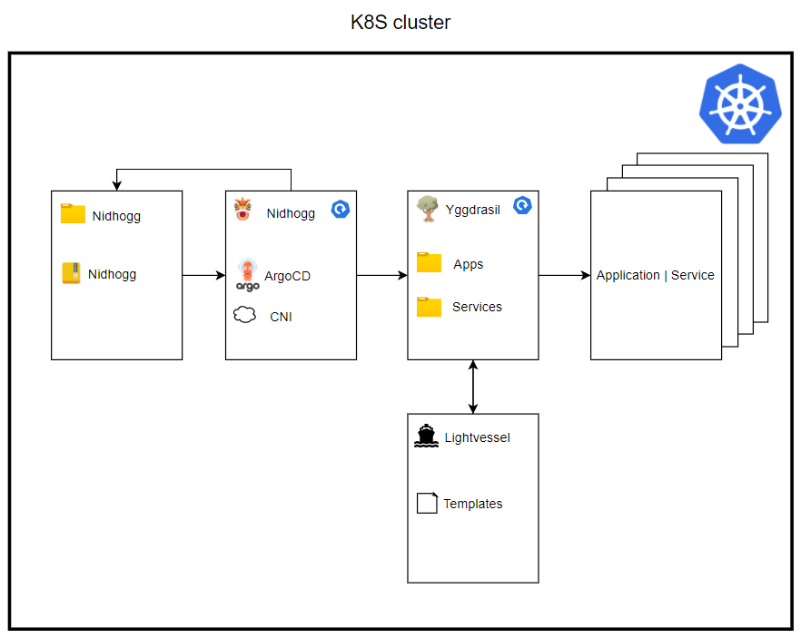

[](https://github.com/Open-Dataplatform/yggdrasil-env/actions/workflows/lint-and-test.yaml)


- [Yggdrasil](#yggdrasil)
  * [Principles](#principles)
    + [Application repository](#application-repository)
    + [Environment repository](#environment-repository)
    + [Yggdrasil](#yggdrasil-1)
    + [Application and service](#application-and-service)
  * [Charts in Yggdrasil](#charts-in-yggdrasil)
    + [Nidhogg](#nidhogg)
    + [Lightvessel](#lightvessel)
    + [Yggdrasil](#yggdrasil-2)
- [How to create your own cluster](#how-to-create-your-own-cluster)
    + [Cluster specific values](#cluster-specific-values)
- [How to add an application](#how-to-add-an-application)
    + [Step one](#step-one)
    + [Step two](#step-two)
    + [Values file](#values-file)
    + [Defining a project](#defining-a-project)
    + [Network policies](#network-policies)
    + [Resource-quota](#resource-quota)
- [Installing chart](#installing-chart)
  * [Manual setup](#manual-setup)
    + [Minio setup for argocd](#minio-setup-for-argocd)
- [linting](#linting)
- [Known issues](#known-issues)

# Yggdrasil
This is the repository for the cluster environment. It contains two Helm charts called Nidhogg and Yggdrasil.

## Principles
When deciding on a workflow for deploying new applications and maintaining running applications on the cluster, we have adopted some of the principles from [GitOps](https://www.gitops.tech/). These principles will be defined in the following sections.

### Application repository
The application repository contains the source code of the application and the deployment manifests to deploy the application.

### Environment repository
The environment repository contains all deployment manifests of the currently desired infrastructure of an deployment environment. It describes what applications and infrastructural services should run with what configuration and version in the deployment environment.

### Yggdrasil
The cluster environment repository contains the configurations for each application on the cluster. It describes the names, namespaces, sources and destinations of any application that is running on the cluster.

### Application and service
Services that run on the cluster are the applications that are needed for cluster maintenance. This is for example Prometheus and Ceph. Applications refer to 3rd party applications or applications developed by distributed technologies and could refer to data science projects.

## Charts in Yggdrasil
This section describes the two charts found in Yggdrasil, Nidhogg and Yggdrasil.

### Nidhogg
Nidhogg is the first Helm chart to be installed and it bootstraps all the applications in our cluster. The Nidhogg chart has a single dependency which is on the Nidhogg release from [this repository](https://github.com/distributed-technologies/nidhogg). Contained in this Nidhogg release is two dependencies: ArgoCD and a CNI(container network interface). The CNI can be disabled by default in case your cluster already has a CNI. The chart also contains a reference to Yggdrasil. This will deploy everything within the Yggdrasil chart.
This is illustrated in the following image.


As stated, Nidhogg also contains a reference to Yggdrasil, which will be deployed onto the cluster. Yggdrasil is the chart that holds references to all the applications and services that will be deployed onto the cluster. This deployment happens automatically when Nidhogg and ArgoCD are deployed.

### Lightvessel
Lightvessel is a repository that holds all the templates necessary to deploy services and applications on the cluster. This is templated into Yggdrasil with the `define`-block from Helm. It was decided to separate this code from Yggdrasil to lower the need for updating your own cloned or forked code. Instead, we will release versions of Lightvessel and getting the newest update is as easy as changing the version on the dependency in Yggdrasil. The current templates are:
- _application.yaml: Where the application is defined, a source provided and a target provided.
- _namespace.yaml: Where the namespace is defined.
- _project.yaml: Where the ArgoCD project is defined if the application should be in a project.
- _ingress.yaml: Where Ingress is specified.

### Yggdrasil
Yggdrasil is the chart in which both developers and 3rd party developers will need to add their deployments into, to deploy them onto the cluster. Kubernetes manifests are generated using Helm templates from Lightvessel.

These templates will automatically generate new manifests when another application is created in Yggdrasil. This will be further elaborated in [How to add an application](#how-to-add-an-application).

In the next section, it will be described how to create your own cluster from this project.

# How to create your own cluster
Many of the design choices for Yggdrasil have been made to make it easier for internal and external organizations or developers to create their own cluster. Lightvessel and the Nidhogg release were made specifically so that there will rarely ever be a need to merge changes in from our version of Yggdrasil. The changes we make will be released in a Lightvessel or Nidhogg release and therefore it is only necessary to change the dependency version. This means that when you would like to create a new cluster, you can simply **clone** or **fork** this repository.

### Cluster specific values
The developers from Distributed Technologies at Energinet will not know your specific cluster details. Therefore, you have to define these yourself. Most of the cluster-specific values can be found and set in the file `nidhogg/values.yaml`. Included in these values is whether not to enable the CNI, the loadbalancer IPs and the IngressDomain. When these values have been set, you are now ready to [install the chart](#installing-chart).

In the next section, it will be described how to create the config and values file needed to deploy applications to the cluster.

# How to add an application
The workflow for deploying applications on the cluster is shown in the image below.


### Step one
The developers of either a 3rd party application or the maintainers of the cluster should create a new application reposity that contains the code for their app. When this code is committed, it should trigger a build pipeline that will update the artifact repository. After this, the environment repository will need to be either manually or automatically updates to reflect the new artifacts.

### Step two
Now that the application is created, the developers needs to create a pull request to Yggdrasil. Depending on if it is a service or an application, it should be in the correct folder. This pull request should add two files to a new folder in either the services or applications subdirectories. These files should be called `config.yaml` and `<nameofapp>/<valueFile>.yaml`:

An example of the config.yaml is seen here:

``` yaml
name: <appName>
namespace: <namespace>
# Optional
# This determins the 'destination.server' and 'project.destination[0].server'
# If this is not set they will default to 'https://kubernetes.default.svc'
# If this is set - all apps in this config will be deployed to that server
# A namespace will not be made by the lightvessel template
# The syncOption createNamespace will be set to true
destinationServer: <server>
description: <description>
# Optional
# Global labels - these will be set on all apps in the config
# the label 'app: <appName>' is set by default
namespaceLabels:
  label1: label1
labels:
  label1: label1
# This defines the applications that will be deployed.
# It is a list in cause you would like to deploy multiple applications
# to the same argocd project and namespace
apps:
  - name: <applicationName>
    # Optional
    # App specific labels - these will only be set on that app
    label:
      <label1>: <label>
    # Defines the source of the helm chart either a chart repo or a git repo
    source:
      repoURL: '<repoURL'
      # For a git repo the Standard targetRevision is HEAD
      # For a helm repo the targetRevision is the version of the chart you want
      targetRevision: <branch>
      # The path and chart key's cannot be used together
      # Path to Helm chart in git repo. Should be . if Helm chart is in root
      path: <path>
      # Incase the repoURL is a helm repo, you need to add this
      chart: <chartName>
      # Filename of values file that is local right next to this config.yaml file
      valuesFile: "<valuesFile>.yaml"
```

### Values file
Each appilcation also has to have a values file, the values file has to live in a folder which has the same name as the application in the `config.yaml` it relates to.

folder structure:
```
yggdrasil
├── Chart.yaml
├── applications
│   ├── <ApplicationName>
│   │   ├── config.yaml
│   │   ├── project.yaml
│   │   └── <appName> # name of the application defined the config.yaml
│   │       └── <valuesFile>.yaml
│   └── transformations
│       ├── config.yaml
│       ├── project.yaml
│       └── t-i2et-sf6
│           └── t-i2et-sf6.yaml
├── services
│   ├── monitoring
│   │   ├── config.yaml
│   │   ├── project.yaml
│   │   └── prometheus
│   │       └── prometheus.yaml
│   └── tooling
│       ├── argo-workflows
│       │   └── argowf.yaml
│       ├── config.yaml
│       └── project.yaml
├── templates
│   ├── application.yaml
│   └── project.yaml
└── values.yaml
```

### Defining a project
Next to the config.yaml file, every namespace should have a project definition. This is important because projects isolate namespaces and services from interfering with each other.
A project definition could look like this:
``` yaml
description: <name> Argo Project
sourceRepos:
- '*'
destinations:
- namespace: <namespace>
  server: https://kubernetes.default.svc
clusterResourceWhitelist:
- group: '*'
  kind: 'Deployment'
```
More options to configure the project can be found [here](https://argo-cd.readthedocs.io/en/latest/operator-manual/project.yaml).

### Network policies
Contributors should also define a networkPolicy and a resourceQuota for your namespace. These files should be placed next to the config.yaml and be called network-policy.yaml and resource-quota.yaml. It is only possible to include the `spec` part of these resources. A typical network-policy could look like this:
``` yaml
podSelector: {}
policyTypes:
- Ingress
- Egress
ingress:
- from:
  - namespaceSelector:
      matchLabels:
        space: service
egress:
- to:
  - namespaceSelector:
      matchLabels:
        space: service
```

### Resource-quota
A typical resource-quota could look like this:
``` yaml
hard:
  requests.cpu: "8"
  requests.memory: 20Gi
  limits.cpu: "16"
  limits.memory: 40Gi
```

The last thing you need to do, after you've added an application to yggdrasil via the `config.yaml`, is to go to the [values.yaml](yggdrasil/values.yaml) and under the right "header" comment add the name of the app and the enabled status.

The "headers" corresponds the the first folder in the applications folder that your app belongs to.
So if you're adding another folder to that applications folder you would then also add a new "header" to the [values.yaml](yggdrasil/values.yaml) file.

f.eks: if you're adding a transformation you would add you appname under `# Transformations` follow by the desired state of the app.
```
...
applications:
  ...
  # Data catalog
  datacatalog-secrets: true
  datacatalog-frontend: true
  datacatalog-backend: true

  # Osiris
  osiris-secrets: true
  osiris-ingress: true
  osiris-egress: true

  # Adapters
  adapters-secrets: true
  a-ikontrol: true

  # Transformations
  transformations-secrets: true
  t-i2et-sf6: true
...
```

A PR will then need to be approved by the cluster development team, before it is merged into Yggdrasil. When this is merged, ArgoCD will automatically deploy the application onto the cluster.
When the deployment is done, ArgoCD will poll the environment repository every 3 minutes, to check for changes to the application.

# Installing chart
Since this is build as an environment version of yggdrasil this does not need to be installed as a "normal" helm chart but rather it is designed to be an application inside of yggdrasil.

To do this you just make the same steps as you do in the [How to add an application](#how-to-add-an-application) step.

you would just add the yggdrasil path instead of installing nidhogg - since the idear is that the parent cluster's argocd service will maintain the applications in the yggdrasil environment.

## Manual setup
Even though this is a enviroment setup - there is sadly still some manual setup.

### Minio setup for argocd

There is also the need of configuring the minio for argo-workflows
Since it's currently not plausible to autogenerate a bucket - we need to generate one manually.
This is done by using the following command

    kubectl port-forward -n tooling svc/console 9090

This will alow us to access the minio-operator web-ui on http://localhost:9090
where you need a JWT token to log-in this can be gained by using

    kubectl -n tooling get $(kubectl get secrets -n tooling -o name| grep "minio-operator") -o jsonpath='{.data.token}' | base64 -di

use the output to log into the web-ui

1. click on the argo-artifacts tenant
2. click manage tenant
3. go to bucket in the left menu
4. click create bucket in the upper right button
5. give it the name `argo-artifacts`

That should be all that is needed for the minio setup for argo-workflows.

# linting
It is always a good idear to lint a chart before you push it - this will also be done on pull request - but if you want to see if you have made any mistakes before you push, I will give you some guids to how you can run linting of you so desire.


1. we need two tools<br>
<tb> - [chart-testing](https://github.com/helm/chart-testing#installation)<br>
<tb> - [yamllint](https://github.com/adrienverge/yamllint#installation)

2. Then make sure you're standing in the yggdrasil-env folder and run: <br>
`ct lint --config ./.github/configs/ct-lint.yaml --lint-conf ./.github/configs/lintconf.yaml`

This will performe linting on the chart and make sure we're consistent with our yaml.

# Known issues
| Issue | optional |
|-------|-------------|
| Currently there are some problems with the PathPrefixStrip middleware and the forward-auth middlware. | https://github.com/thomseddon/traefik-forward-auth/pull/49 |
| There are also currently no way to get the token from the header. | https://github.com/thomseddon/traefik-forward-auth/pull/100 |